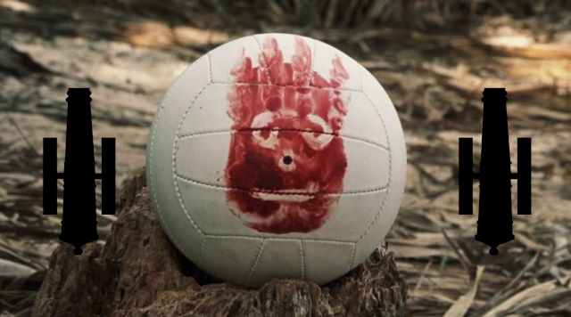

# QGL - WEEK11

Analysis run the 20/04/2020 at 07:31

## Game results

||Flag|Score|
|--|--|--|
|fellowship_survivors||**343** [See details](./pool-3/fellowship_survivors.log)|
|stormbreakers||**339** [See details](./pool-1/stormbreakers.log)|
|flibustiers||**325** [See details](./pool-2/flibustiers.log)|
|zecommit||**307** [See details](./pool-0/zecommit.log)|
|lesTablesAHauteurDeGenoux||**293** [See details](./pool-2/lesTablesAHauteurDeGenoux.log)|
|c_h4ck3rz||**Game not finished** (UnfinishedError) [See details](./pool-0/c_h4ck3rz.log)|
|polysson||**Game not finished** (DestroyedShipError) [See details](./pool-0/polysson.log)|
|fourbits||**Game not finished** (DestroyedShipError) [See details](./pool-1/fourbits.log)|
|Lesboucaniers||**Game not finished** (DestroyedShipError) [See details](./pool-1/Lesboucaniers.log)|
|team_jar||**Game not finished** (GenericClientError) [See details](./pool-2/team_jar.log)|
|Redemption||**Game not finished** (UnfinishedError) [See details](./pool-3/Redemption.log)|
|thepiratebay||**Game not finished** (DestroyedShipError) [See details](./pool-3/thepiratebay.log)|
|vendredi||**Game not finished** (DestroyedShipError) [See details](./pool-4/vendredi.log)|

## Championship status

|Rank|Team|Flag|Score|
|--|--|--|--|
|**1**|team_jar||**129**|
|**2**|flibustiers||**113**|
|**3**|fellowship_survivors||**102**|
|**4**|stormbreakers||**72**|
|**5**|zecommit||**70**|
|**6**|Lesboucaniers||**63**|
|**7**|lesTablesAHauteurDeGenoux||**57**|
|**8**|theblackpearl||**47**|
|**9**|fourbits||**45**|
|**10**|Redemption||**39**|
|**11**|polysson||**34**|
|**12**|vendredi||**30**|
|**13**|c_h4ck3rz||**24**|
|**14**|lequipagedugitkraken||**17**|
|**14**|thepiratebay||**17**|
|**16**|tipiak||**0**|
|**16**|AlterCode||**0**|
|**16**|macbernik||**0**|
